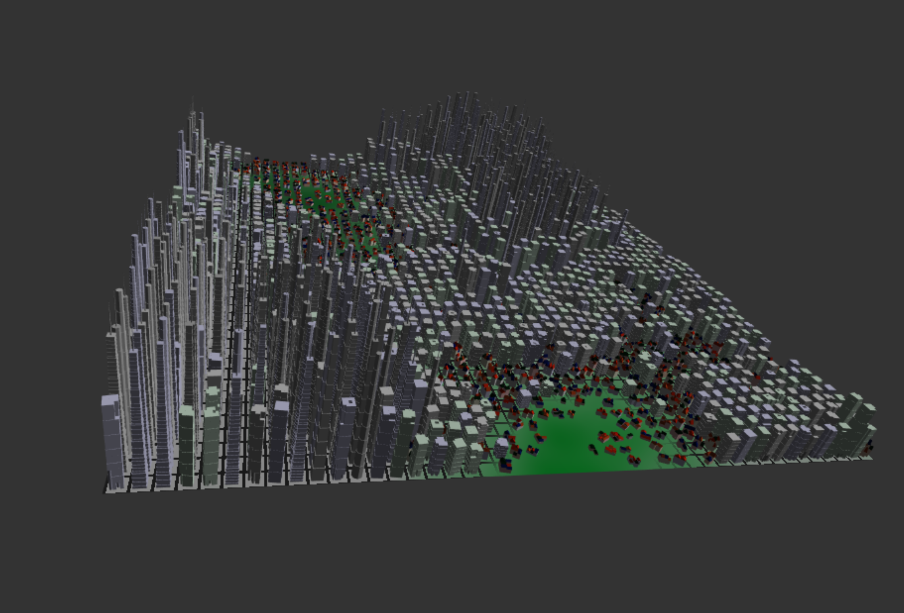
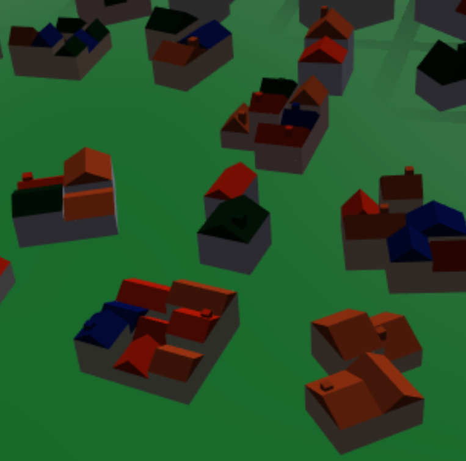
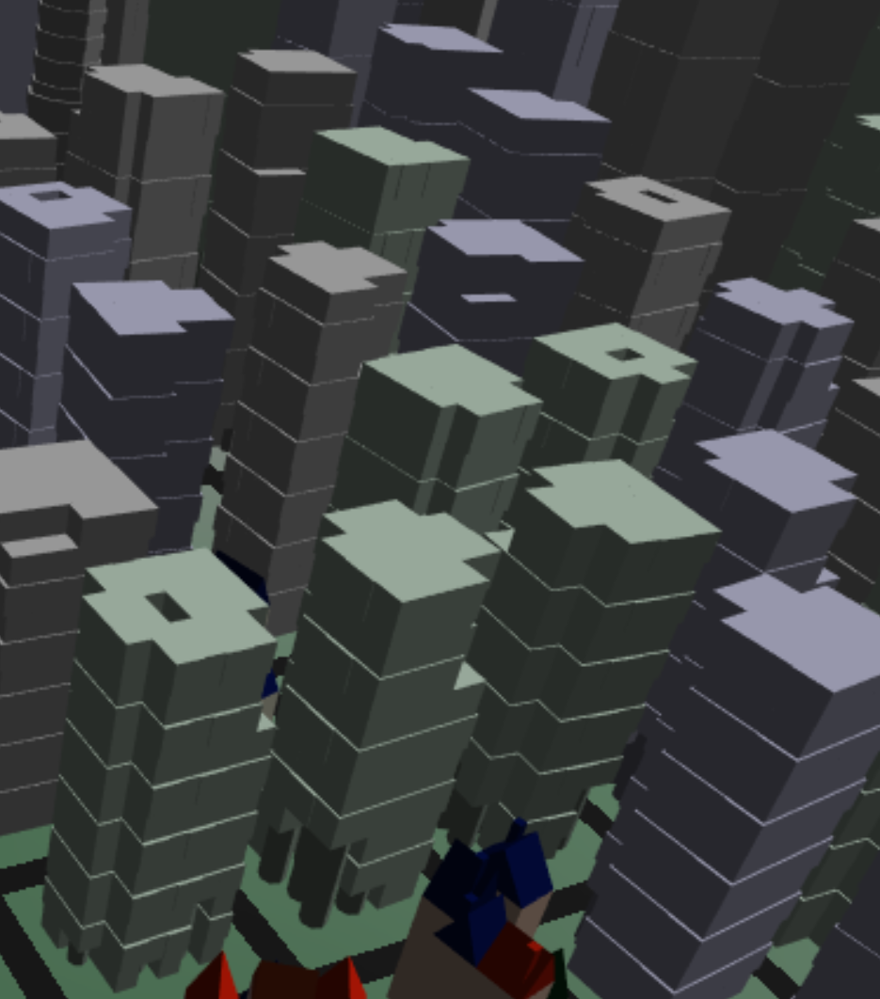
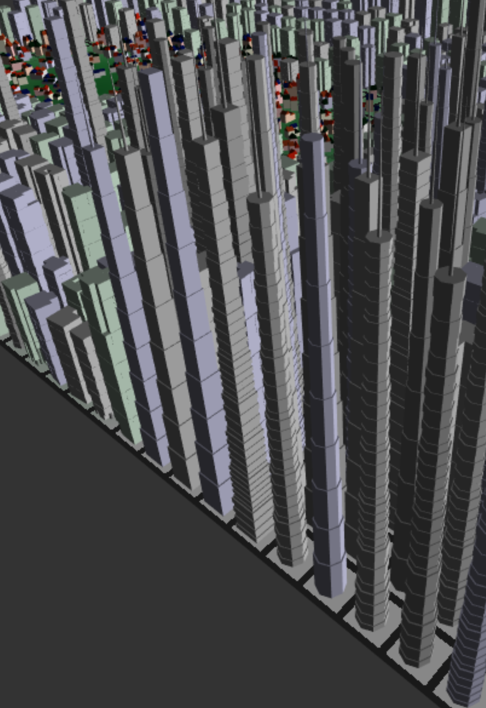
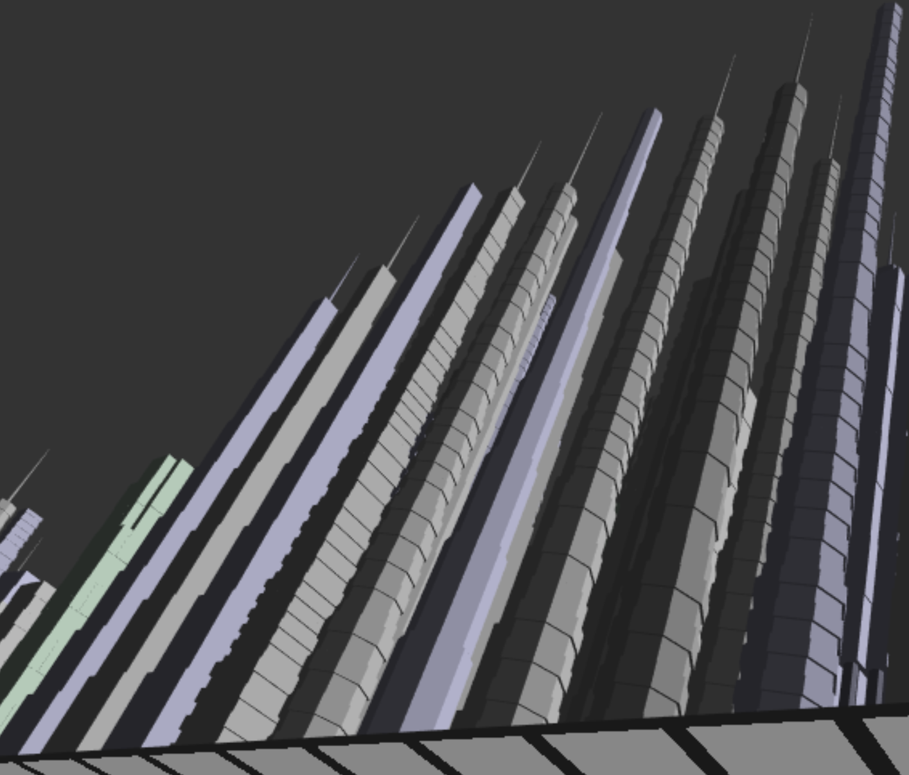
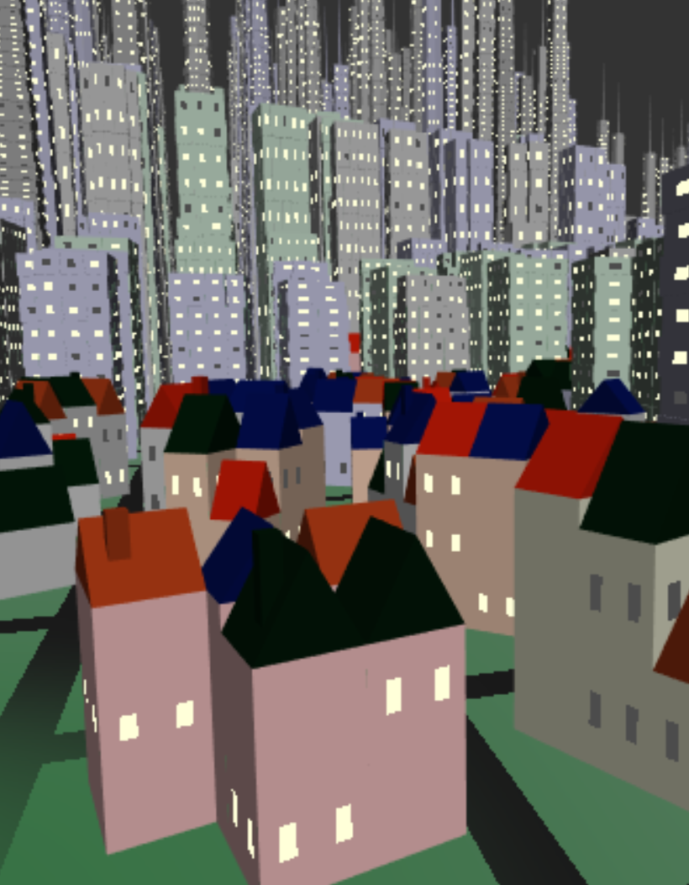

# Project 5: Shape Grammar

## Student Info

* Name: Mauricio Mutai
* PennKey: `mmutai`

## Demo

Click below to go to the demo!

### Quick Start

* Move camera to desired position.
* Toggle `useDebugColor` if you want a more colorful experience.
* Click on `Iterate` six times (after the second one, iterations may be a bit slow). You can stop once all types of buildings have bright windows on them.
* Enjoy.
* You can modify the `perlinSeed`, click on `Regenerate City`, then iterate five times again if you want to see the city built on a different population density distribution.

## Controls

Below is an explanation of how to use the controls in the demo. A similar explanation of the controls can be accessed by clicking "Show Help" in the demo. Note that, unless otherwise specified, changes will only become visible if you redraw the city using `Regenerate City` or `Redraw City`.

* `Light Position`: Changes the light position for shading. Updates automatically (redrawing plant is not needed).
* `randomMode`: Changes how "random" numbers are generated. The options are `Math.random()` and a deterministic seeded noise function. Using the seeded noise function is recommended if you want to redraw the same plant while tweaking other parameters, such as colors and fruit.
* `randomSeed`: Changes the seed for the deterministic seeded noise function.
* `useDebugColor`: Toggles between using "debug colors" or "regular colors". See more below.
* `perlinSeed`: Changes the seed for the Perlin noise function.
* `Regenerate City`: Regenerates shape grammar string, re-expands it, then redraws city.
* `Redraw City`: Redraws city without modifying shape grammar string. Note that if your `randomMode` is `Math.random()`, you will get different results, although the general structure of the city will still be the same. Similarly, using the seeded noise function and changing the seed will lead to different results.
* `Show Help`: Shows a help message.
* `showWindows`: Toggles rendering windows on buildings.

If you change the Perlin seed, you will modify the general structure of the city (this will modify the population density distribution). Redrawing the city without changing the Perlin seed will only lead to small changes local to each building.

## Techniques Used

### General Inspiration

Broadly speaking, I was inspired by games like SimCity 4, in which you can have low, medium, or high-density buildings. In SC4, there is another orthogonal set of categories for buildings (residential, commercial, industrial), but I chose to only implement residential-like buildings for this demo.

### Building Shape Grammar

Below is a list of each symbol, as well as a description of how it expands with each iteration. Unless otherwise mentioned, the number of cubes a cube is subdivided into is randomly chosen.

There are three types of building: low, medium, and high-density buildings. The density here refers to populational density.

Note each symbol stores how many times it has been expanded, which is how the symbols know whether they are on the first iteration, or the second one, etc. Each symbol also keeps track of whether it's part of the edges of the building (i.e. whether it lies on the faces of the original undivided cube).

Each symbol also stores other useful information, like position, rotation, scale, as well as more specific values in each subclass.

When a symbol adds windows to itself, it essentially gives itself different UVs. Note that each symbol with windows will have a small chance to have dark windows instead of the default bright windows. This chance varies across `LDCube`, `MDCube`, and `HDCube`.

* `LDCube`: Base for low-density buildings. A cube.
  * For the first two iterations, will subdivide itself into smaller `LDCubes` in the X and Z directions. Each subdivision will be in a different direction, but which one happens first (X or Z) is random.
  * For the third iteration, will delete itself with a small chance. 
  * For the fourth iteration, will subdivide along Y once and transform the topmost `LDCube` into an `LDRoof`. After this, all `LDCubes` become terminal.
  * For the fifth iteration. will add windows to itself with low probability, or moderate probability if this is a "bottom" block. Windows are dark half of the time.
* `LDRoof`: A roof for low-density buildings. A triangular prism.
  * For the first iteration, has a small chance to add a chimney (small scaled cube). After this, becomes terminal.
* `MDCube`: Base for medium-density buildings. A cube.
  * For the first two iterations, will subdivide itself into smaller `LDCubes` in the X and Z directions. Each subdivision will be in a different direction, but which one happens first (X or Z) is random.
  * For the third iteration, does the following:
    * Attempt to delete itself if:
      * This is a "corner" block, with low probability. 
      * This is an "outer" block, with lower probability. 
    * If the block does not delete itself, then it will:
      * Subdivide itself along Y. The number of sub-blocks is the same within each building, but varies across buildings.
      * With low probability, mark a random number of the bottommost blocks as columns.
      * With low probability, mark a random number of the topmost blocks as deleted.
      * Scale every other sub-block (along Y) in order to create some "texture".
  * For the fourth iteration, if this block is marked as a column, replace itself with an `MDCylinder`.
  * For the fifth iteration, if this block is marked as deleted, delete itself.
  * For the sixth iteration, will add windows to itself. Windows are occasionally dark.
* `MDCylinder`: A column used in medium-density buildings. An octagonal prism.
    * This is a terminal symbol.
* `HDCube`: Base for high-density buildings. Initially a cube; may become an octagonal prism.
    * For the first iteration, does the following:
      * Randomly decide if this will be a round or rectangular building.
        * If this is a round building, converts itself into an octagonal prism.
      * Randomly decide if this will be a straight or "alternating" building.
      * Subdivide itself along Y.
    * For the second iteration, does the following:
      * If this is a "top" block, converts itself into a spike with a moderate-high chance. The spike is a dodecagonal prism with the top scaled to be significantly smaller than the bottom.
      * Else, if this is an "alternating" building:
        * Subdivide itself along Y such that an odd number of sub-blocks is generated, including the original block.
        * Scale every other block in order to create some "texture".
    * For the third iteration, will add windows to itself. Windows are rarely dark.

### Building Shape Grammar - Examples

Note that the images below, except for the last one, show buildings without windows.

Low-density:

Medium-density:

High-density (from top):

High-density (from bottom):

Buildings with windows:

### Building Layout

Here is the process used to place buildings on the scene:

* On a uniform grid (the top of the ground plane), for each point on the grid:
  * Sample FBM'd Perlin noise at the point. This value, `fbm`, is interpreted as the populational density at that point.
  * If `fbm` is low:
    * Place a low-density building with high probability.
    * Place a medium-density building with low probability.
    * Else, place no building (with the remaining low probability).
  * Else, if `fbm` is mid-range:
    * Place a medium-density building with high probability.
    * Place a low-density building with low probability.
    * Else, place a high-density building (with the remaining low probability).
  * Else, `fbm` is high, so:
    * Place a high-density building with high probability.
    * Else, place a medium-density building (with the remaining low probability).
* Building heights are affected by which of the three categories above they belong to, i.e. medium-density buildings in a low-`fbm` area are slightly shorter than medium-density buildings in a mid-`fbm` area, and significantly shorter than those in a high-`fbm` area.
    * The point of this is to allow for a smoother transition between the `fbm` categories.
* Note the probabilities mentioned above are scaled by where the `fbm` lies within its category (i.e. if the `fbm` is close to the threshold between low and mid, the probability for a low-`fbm` area will be weighed towards medium-density buildings).
    * This also serves to promote smoother transitions.

### Building Colors

* If using "debug" colors:
  * Low-density buildings are blue. (The roofs are pink -- this is also a "debugging feature".)
  * Medium-density buildings are green.
  * High-density buildings are red.
  * As a symbol subdivides itself, it will darken its color, with sub-blocks farther from the original block being darker.
* Else, using "regular" colors:
  * Each symbol has a set of colors it randomly picks upon being constructed. This color is inherited by its children.

### Ground Plane Color

* A "procedural texture" is used that takes into account the `fbm` value at the fragment. This determines how green it is, and whether it has a street on it.

## Original README below

For this assignment you'll be building directly off of the L-system code you
wrote last week.

**Goal:** to model an urban environment using a shape grammar.

**Note:** We’re well aware that a nice-looking procedural city is a lot of work for a single week. Focus on designing a nice building grammar. The city layout strategies outlined in class (the extended l-systems) are complex and not expected. We will be satisfied with something reasonably simple, just not a uniform grid!

## Symbol Node (5 points)
Modify your symbol node class to include attributes necessary for rendering, such as
- Associated geometry instance
- Position
- Scale
- Anything else you may need

## Grammar design (55 points)
- Design at least five shape grammar rules for producing procedural buildings. Your buildings should vary in geometry and decorative features (beyond just differently-scaled cubes!). At least some of your rules should create child geometry that is in some way dependent on its parent’s state. (20 points)
    - Eg. A building may be subdivided along the x, y, or z axis into two smaller buildings
    - Some of your rules must be designed to use some property about its location. (10 points)
    - Your grammar should have some element of variation so your buildings are non-deterministic.  Eg. your buildings sometimes subdivide along the x axis, and sometimes the y. (10 points)   
- Write a renderer that will interpret the results of your shape grammar parser and adds the appropriate geometry to your scene for each symbol in your set. (10 points)

## Create a city (30 points)
- Add a ground plane or some other base terrain to your scene (0 points, come on now)
- Using any strategy you’d like, procedurally generate features that demarcate your city into different areas in an interesting and plausible way (Just a uniform grid is neither interesting nor plausible). (20 points)
    - Suggestions: roads, rivers, lakes, parks, high-population density
    - Note, these features don’t have to be directly visible, like high-population density, but they should somehow be visible in the appearance or arrangement of your buildings. Eg. High population density is more likely to generate taller buildings
- Generate buildings throughout your city, using information about your city’s features. Color your buildings with a method that uses some aspect of its state. Eg. Color buildings by height, by population density, by number of rules used to generate it. (5 points)
- Document your grammar rules and general approach in the readme. (5 points)
- ???
- Profit.

## Make it interesting (10)
Experiment! Make your city a work of art.

## Warnings:
If you're not careful with how many draw calls you make in a single `tick()`,
you can very easily blow up your CPU with this assignment. As with the L-system,
try to group geometry into one VBO so the run-time of your program outside of
the time spent generating the city is fast.

## Suggestions for the overachievers:
Go for a very high level of decorative detail!
Place buildings with a strategy such that buildings have doors and windows that are always accessible.
Generate buildings with coherent interiors
If dividing your city into lots, generate odd-shaped lots and create building meshes that match their shape .i.e. rather than working with cubes, extrude upwards from the building footprints you find to generate a starting mesh to subdivide rather than starting with platonic geometry.
